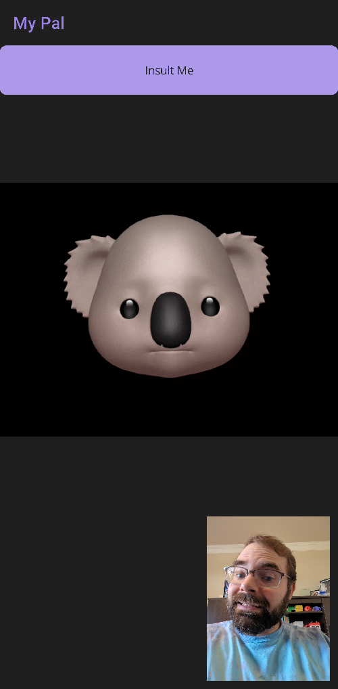

# MyPal

A .NET MAUI sample application that uses omni-input LLMs to create "My
Pal", a friendly koala that insults you based on a selfie!



https://github.com/user-attachments/assets/a58c7494-07f2-42d6-b639-f1e66fecc59e

This sample runs on iOS and Android, but could be adapted for desktop
in the future.

## Azure Setup

This app requires 3 Azure services:

* Azure OpenAI: `gpt-4o` instance
* Azure OpenAI: `tts` instance
* Azure Application Insights: for telemetry

I created these in North Central US, as that region supports both gpt-4o and tts:

* https://learn.microsoft.com/azure/ai-services/openai/concepts/models

When creating a model deployment in Azure OpenAI Studio, name them
exactly `gpt-4o` and `tts`, otherwise you will need to use different
names in `MyPalWebClient.cs`.

You can also try a `tts-hd` model, but that seemed to just increase
the latency of each request. It would be more useful for making
high-quality voiceovers, though.

Lastly, I made an Azure Log Analytics (dependency of Application
Insights) and Azure Application Insights instance in North Central US.
If you want to skip this step, you can remove the Application Insights
code from the .NET MAUI app.

## Secrets

For any of the three apps to work:

* `MyPal.Benchmarks`
* `MyPal.Console`
* `MyPal.MauiApp`

Create a `runtimeconfig.template.json` with the contents:

```json
{
  "configProperties": {
    "APPLICATIONINSIGHTS_CONNECTION_STRING": "secret here",
    "OPENAI_API_KEY": "secret here"
  }
}
```

`APPLICATIONINSIGHTS_CONNECTION_STRING` is only required for the .NET MAUI app.

## Notes about Performance

Originally, I made two requests:

* `CompleteChatAsync()` from `gpt-4o`, returns text. Around 11 seconds!
* `GenerateSpeechFromTextAsync()` from `tts-hd`, returns audio. Around 5 seconds!

Some initial performance changes, I made:

* Use a 150x200 image, which seems to be good enough in detail for
  `gpt-4o` to read as input. Down to ~10 second request.

* Use `tts` instead of `tts-hd`, it is faster but lower quality. Down
  to a ~4 second request.

This is still about 14 seconds, which is too slow for a real-time
"pal" like I was trying to make.

Next, I tried the streaming API for the initial request:

* Call `CompleteChatStreamingAsync()` from `gpt-4o`.

* When the first complete sentence is returned, start the audio
  generation with `GenerateSpeechFromTextAsync()` from `tts`.

This made me track a new metric, "time to first audio", which is
around 9 seconds. This is still too slow for a real-time "pal", but
I'm going with this implementation for now.

The demos we see in ChatGPT videos are likely using a more powerful
APIs we don't have access to yet:

* https://www.youtube.com/live/DQacCB9tDaw
